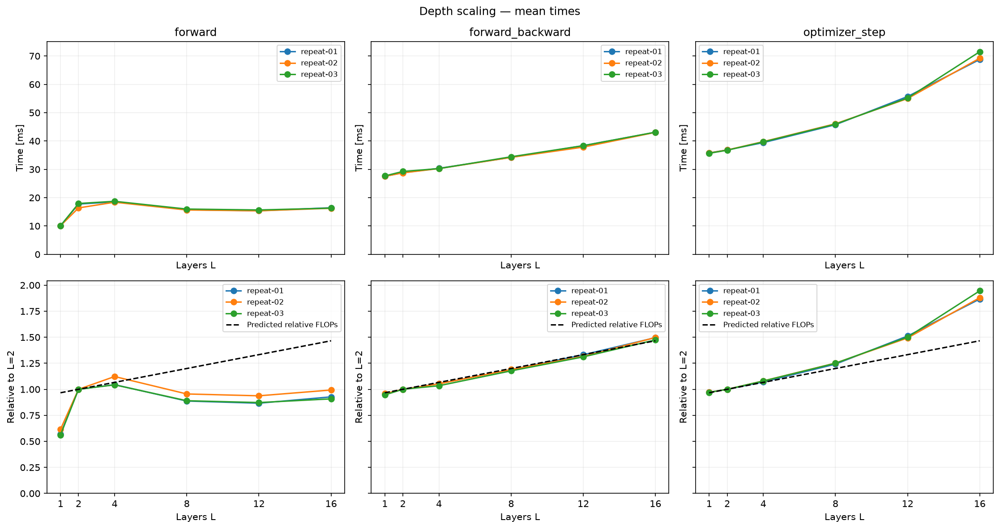

# Depth scaling

How does increasing the number of layers affect compute and runtime?

B=2, T=128, D=128, H=4, V=50257, context=256. FP32, naive attention.
Only L changes: 1, 2, 4, 8, 12, 16.

## Predictions

### Forward pass

We approximate the dominant matrix multiplications, counting one multiply-add as two FLOPs:

$$
F_{\text{block}} \approx 24BTD^2 + 4BT^2D
$$

$$
F_{\text{head}} \approx 2BTDV
$$

$$
F_{\text{forward}}(L) \approx L F_{\text{block}} + F_{\text{head}}
$$

For B=2, T=128, D=128 and V=50257:

$$
F_{\text{block}} \approx 117{,}440{,}512 \text{ FLOPs}
\approx 0.1174 \text{ GFLOPs}
$$

$$
F_{\text{head}} \approx 3{,}293{,}642{,}752 \text{ FLOPs}
\approx 3.2936 \text{ GFLOPs}
$$

### When do blocks match the head?

$$
L_* F_{\text{block}} = F_{\text{head}}
$$

$$
L_* =
\frac{2BTDV}{24BTD^2+4BT^2D}
=
\frac{V}{12D+2T}
$$

$$
L_* = \frac{50257}{12\cdot128+2\cdot128}
\approx 28.05
$$

### Backward pass

For a matrix multiplication, backward computes gradients for both inputs:

$$
Y=XW,\qquad
\nabla_X=\nabla_Y W^\top,\qquad
\nabla_W=X^\top\nabla_Y
$$

Each gradient matmul has the same FLOP count as the forward matmul:

$$
F_{\text{backward}} \approx 2F_{\text{forward}}
$$

$$
F_{\text{forward+backward}} \approx 3F_{\text{forward}}
$$

For L=2:

$$
F_{\text{forward}} \approx
3{,}528{,}523{,}776 \text{ FLOPs}
\approx 3.5285 \text{ GFLOPs}
$$

$$
F_{\text{backward}} \approx
7{,}057{,}047{,}552 \text{ FLOPs}
\approx 7.0570 \text{ GFLOPs}
$$

$$
F_{\text{forward+backward}} \approx
10{,}585{,}571{,}328 \text{ FLOPs}
\approx 10.5856 \text{ GFLOPs}
$$

This is a matmul approximation, not an exact count of every backward operation.

### Full optimizer step

A full training step includes forward, backward and an AdamW update:

$$
F_{\text{step}} \approx 3F_{\text{forward}} + F_{\text{AdamW}}
$$

AdamW uses the gradients to update the weights. It also maintains
two moving averages for each parameter: the gradient and its square.

## Measurement

MPS, PyTorch 2.14.0. Three repeats, 5 warmups and 1000 samples per workload.
Synthetic tokens, dropout=0, seed=2137.

| Workload | Timed work |
|---|---|
| forward | Full logits + cross-entropy, with autograd enabled; no backward |
| forward_backward | Same forward + backward; gradient reset outside timing |
| optimizer_step | Gradient reset + forward + backward + AdamW update |

Timing includes device synchronization. Tokens/s = B*T / mean time.

## Results

For L=16 relative to L=2, the matmul model predicts **1.466x** compute.
Ranges below cover the three repeats, each normalized to its own L=2:

| Workload | Mean time ratio | Median time ratio |
|---|---:|---:|
| forward | 0.908–0.993 | 0.905–0.987 |
| forward_backward | 1.474–1.497 | 1.497–1.501 |
| optimizer_step | 1.867–1.946 | 1.860–1.889 |

Forward+backward follows the FLOPs estimate most closely; the full step grows
faster. Forward is irregular — we have not explained why.

[Median plot](figures/depth_median.png) · [Full analysis](analysis.ipynb)

Runs always went from L=1 to L=16, so run order may affect the comparison.
The notebook also includes separate L=2 autograd and memory checks.
It reads saved JSONs; no GPU is needed to view the plots.
